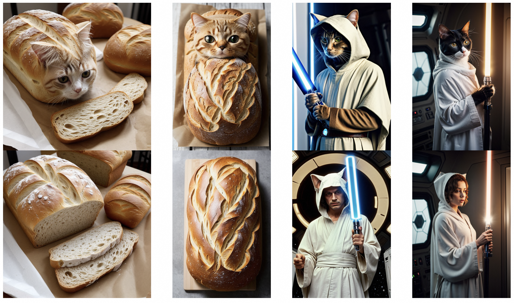

# Concept Semi-Permeable Membrane

### ✏️ [Project Page](https://lyumengyao.github.io/projects/spm) | 📄 [arXiv](https://arxiv.org/abs/2312.16145) | 🤗 Hugging Face



_(The generation samples demonstrating 'Cat' SPM, which is trained on SD v1.4 and applied on [RealisticVision](https://huggingface.co/SG161222/Realistic\_Vision\_V5.1\_noVAE).
The upper row shows the original generation and the lower row shows the SPM-equipped ones.)_

We propose **Concept <u>S</u>emi-<u>P</u>ermeable <u>M</u>embrane (SPM)**, as a solution to erase or edit concepts for diffusion models (DMs).

Briefly, it can achieve two main purposes:

- Prevent the generation of **target concept** from the DMs, while
- Preserve the generation of **non-target concept** of the DMs.

SPM has following advantages:

- **Data-free**: no extra text or image data is needed for training SPM.
- **Lightweight**: the trainable parameters of the SPM is only 0.5% of the DM. A SPM for SD v1.4 only takes 1.7MB space for storage.
- **Customizable**: once obtained, SPMs of different target concept can be equipped simultaneously on the DM according to your needs.
- **Model-transferable**: SPM trained on certain DM can be directly transfered to other personalized models without additional tuning. e.g. SD v1.4 -> SD v1.5 / [Dreamshaper-8](https://huggingface.co/Lykon/dreamshaper-8) or any other similar community models.

## Getting Started

### 0. Setup

We use Conda to setup the training environments:

```bash
conda create -n spm python=3.10
pip install torch torchvision --index-url https://download.pytorch.org/whl/cu118
pip install xformers
pip install -r requirements.txt
```

Additionally, you can setup [**SD-WebUI**](https://github.com/AUTOMATIC1111/stable-diffusion-webui) for generation with SPMs as well.

### 1. Training SPMs

In the [**demo.ipynb**](https://github.com/Con6924/SPM/blob/main/demo.ipynb) notebook we provide tutorials for setting up configs and training. Please refer to the notebook for further details.

### 2. Generate with SPMs

We provide three approaches to generate images after acquiring SPMs:

#### (Recommended) Generate with our provided code

First, you need to setup your generation config. [**configs/generaion.yaml**](https://github.com/Con6924/SPM/blob/main/configs/generaion.yaml) is an example. Then you can generate images by running the following commands:

```shell
python infer_spm.py \
		--config ${generation_config}	\
		--spm_path ${spm_1} ... ${spm_n} \
		--base_model ${base_model_path_or_link} \ 											# e.g. CompVis/stable-diffusion-v1-4
```

#### Generate in the notebook demo

The [**demo.ipynb**](https://github.com/Con6924/SPM/blob/main/demo.ipynb) notebook also offers codes for generate samples with single or multi SPMs. 

*Notice: In this way, the Facilitate Transfer mechanism of SPM will NOT be activated. SPMs will have a relatively higher impact on non-targeted concepts.*

#### Generate with SD-WebUI

The SPMs can be well adapted to the SD-WebUI for more generation options. You can load SPM as a LoRA module to the desired SD model. 

*Notice: In this way, the Facilitate Transfer mechanism of SPM will NOT be activated. SPMs will have a relatively higher impact on non-targeted concepts.*

### 3. Evaluate SPMs

To validate the provided results in our paper, you can run the following code to evaluate the trained SPMs on the four pre-defined tasks. To check the detailed arguments explaination, just run ``python evaluate_task.py -h`` .

```shell
accelerate launch --num_processes ${num_gpus} evaluate_task.py \
		--task ${task} \
		--task_args ${task_args} \
		--img_save_path ${img_save_path} \
		--save_path ${save_path}
```

## Model Zoo

Trained SPM for SD v1.x:

| Task Type         | SPM                                                          |
| ----------------- | ------------------------------------------------------------ |
| General Concepts  | Snoopy, Mickey, Spongebob, Pikachu, Donald Duck, Cat, <br />Wonder Woman (->Gal Gadot), Luke Skywalker (->Darth Vader), Joker (->Heath Ledger), Joker (->Batman) |
| Artistic Styles   | Van Gogh, Picasso, Rembrant, Comic                           |
| Explicit Contents | Nudity                                                       |

SPM for SD v2.x and SDXL will be released in the future.

## References

This repo is the code for the paper *One-dimentional Adapter to Rule Them All: Concepts, Diffusion Models and Erasing Applications*.

Thanks for the creative ideas for the pioneer researches:

- https://github.com/rohitgandikota/erasing: **Erasing Concepts from Diffusion Models**
- https://github.com/nupurkmr9/concept-ablation: **Ablating Concepts in Text-to-Image Diffusion Models**
- https://github.com/clear-nus/selective-amnesia: **Selective Amnesia: A Continual Learning Approach for Forgetting in Deep Generative Models**

In addition, these repos inspires the implementation of ours:

- https://github.com/p1atdev/LECO: **Low-rank adaptation for Erasing COncepts from diffusion models**
- https://github.com/cloneofsimo/lora: **Low-rank Adaptation for Fast Text-to-Image Diffusion Fine-tuning**
- https://github.com/kohya-ss/sd-scripts: **Training, generation and utility scripts for Stable Diffusion** 

If you find this repo useful, you can cite our work as follows:

```tex
@misc{lyu2023onedimensional,
      title={One-dimensional Adapter to Rule Them All: Concepts, Diffusion Models and Erasing Applications}, 
      author={Mengyao Lyu and Yuhong Yang and Haiwen Hong and Hui Chen and Xuan Jin and Yuan He and Hui Xue and Jungong Han and Guiguang Ding},
      year={2023},
      eprint={2312.16145},
      archivePrefix={arXiv},
      primaryClass={cs.CV}
}
```

